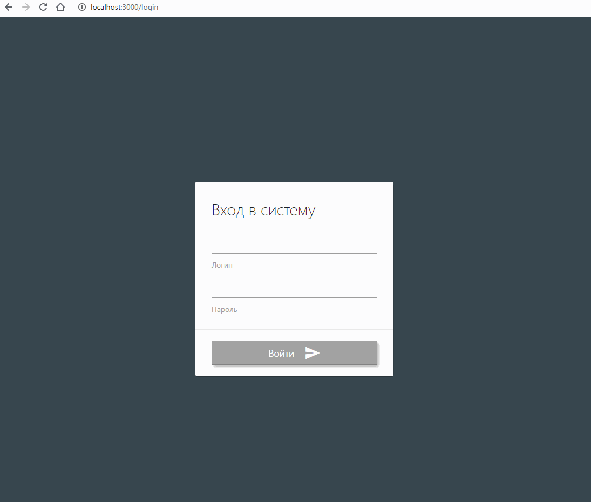

# ТЗ для frontnend разработчика

- Напишите приложение личного кабинета
- В приложении должно быть две страницы - страница входа и страница со списком контактов.
- Для реализации авторизации можно использовать запросы с моковыми данными.
  https://github.com/typicode/json-server
- Страница контактов пользователя должна быть доступна только после авторизации
- На странице контактов должна быть возможность добавлять/удалять/редактировать контакты, также желательно наличие функции поиска.
- Оформление и данные для заполнения страниц на ваше усмотрение.
- Обязательно добавьте информацию в readme о том, как запускать ваше приложение!
- В разработке можно пользоваться UI фреймворками.
- Время на выполнение тестового задания не ограничено.

### Для решения вынес отдельные компоненты в модули

---

репозиторий:

[https://asosunoff.github.io/React-Table/](https://asosunoff.github.io/React-Table/)

[https://asosunoff.github.io/React-Use-Form/](https://asosunoff.github.io/React-Use-Form/)

npm:

[npm i @asosunoff/react-table](https://www.npmjs.com/package/@asosunoff/react-table)

[npm i @asosunoff/react_use_form](https://www.npmjs.com/package/@asosunoff/react_use_form)

---

### Для проверки задания:

---

```
git clone https://github.com/aSosunoff/React_Test_Task_TS.git
cd React_Test_Task_TS
npm i
npm start
login: admin
password: 1234
```


